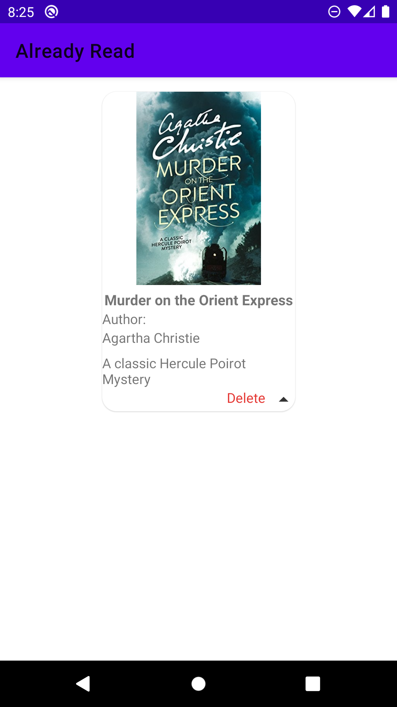

    

# Overview

Do you love books but struggle to organize your collection? Do you wish you had a handy tool to track your reading progress and goals? If you answered yes to any of these questions, then My Library is the app for you. My Library is a companion app that helps you manage your books, and enjoy reading more.

# Download APK
<a href="https://drive.google.com/file/d/1KXshIlbO9LE8e9N-Jv-GWs7-cTxnROTC/view?usp=sharing"> <i>Click here to download</i></a>

# Screenshots
### Simple and organised layouts

  
  
  
  
  
  
  
  

# Key Features
Classify your books into 
- currently reading
- already read
- wishlist, &
- favourite books

# Technologies used
- RecyclerView
- Adapter
- WebView

